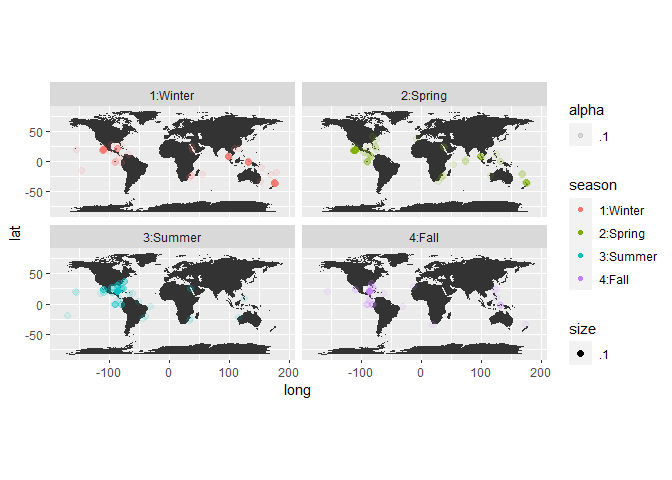

# Title

Authors: Madison Kraft, Luke Engstrom

Co-Author: Dr. Christopher Merkord

Affiliations: Minnesota State University of Moorhead

## Abstract

-   Manta ray migrate where the food is, which makes them hard to study

-   In addition, they are at risk from fisheries and bycatch

-   Using iNaturalist data to see if there are migration patterns

-   Then identifying breeding grounds of two different species of manta
    ray

-   With this information we propose to make these sites protected
    grounds

## Introduction

-   Manta ray are an elusive species, juveniles have never been studied
    in the wild (Stewart et al 2018)

-   Mobula birostris (oceanic ray) and Mobula alfredi (reef ray) are
    both migratory species

-   Reef Rays typically have their mating season from October to January
    (Simpkins 2013)

-   Oceanic Rays are considered year round, but it depends on what
    waters they are in (Manta Ray Reproduction 2018)

-   We are working to identify breeding grounds to propose marine
    protected areas

## Methods

-   Using iNaturalist data, a citizen science program used to catalog
    sightings of organisms

-   Then cleaned up the data using rNat and tidyverse

-   We filtered the data to include species name, latitude, longitude,
    year, month, and day

-   Then made a map with the filtered data

## Results

Figure 1. Map depicting Oceanic Ray sightings based off of the four
seasons.

<!-- -->

Figure 2. Map depicting Reef Ray sightings based off of the four
seasons.

<!-- -->

Figure 3. Map depicting Reef Ray sightings during breeding and non
breeding seasons.

<!-- -->

## Discussion

-   Weather patterns have not impacted the sightings as much as we
    thought
-   For Oceanic Rays it is harder located the breeding grounds due to
    their global presence
-   For Reef Rays there are some locations we believe are breeding
    grounds due to reduced migration
